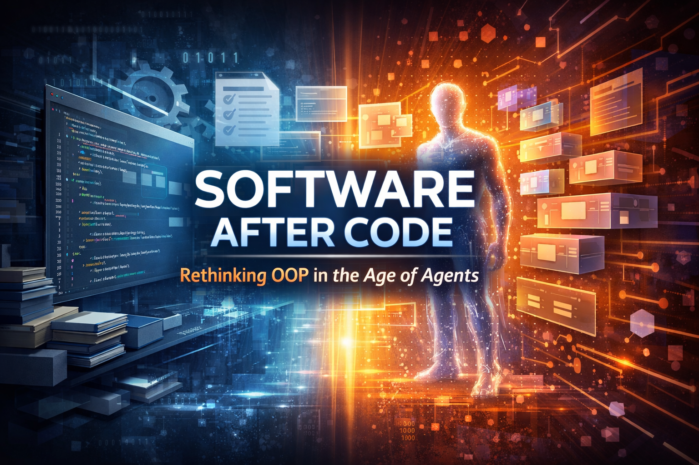
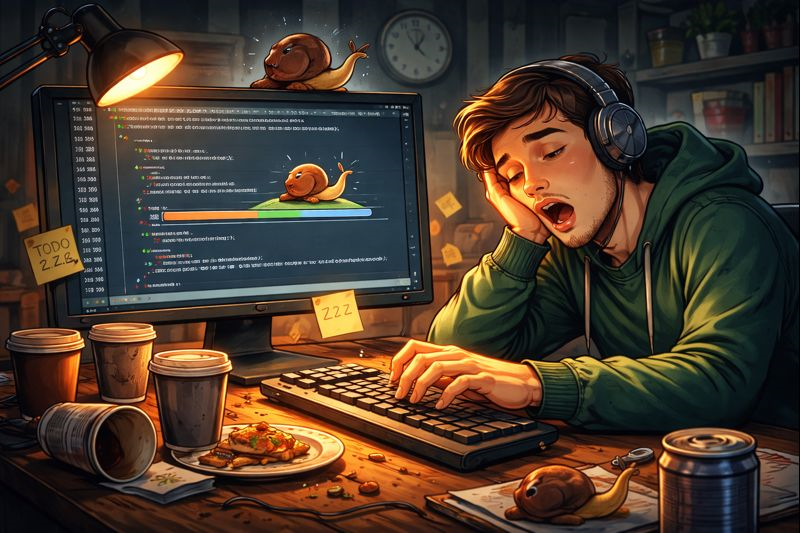
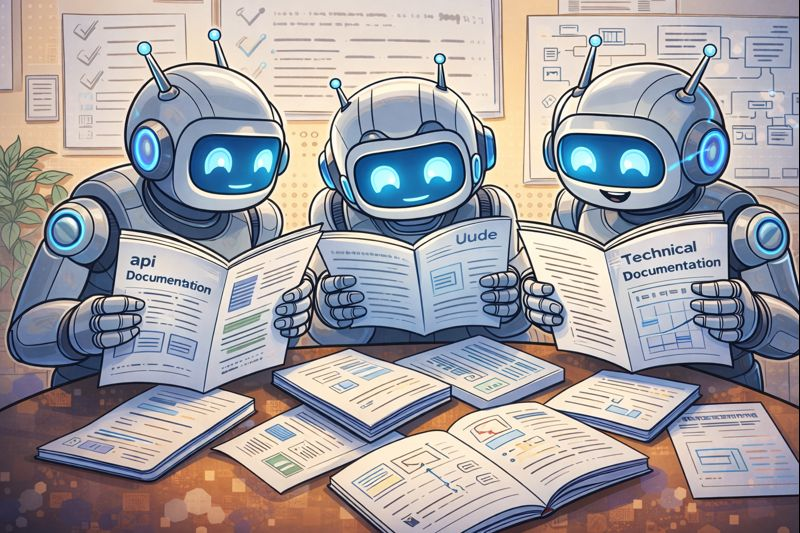
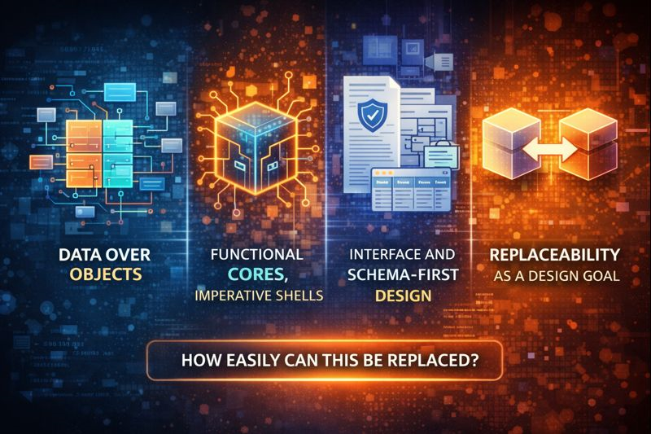

<!---->

Object-Oriented Programming (OOP) is not failing - it is becoming structurally irrelevant for a growing class of software systems. Vibecoding and agent-based development expose a deeper truth: code is no longer the primary unit of software design.

For decades, the equation has held:

> **Software** = **Source code** + **humans maintaining it**

Everything important lived in the code: architecture, business rules, constraints, intent, and plans for future evolution. Documentation was secondary, and tests were often optional. Lose the code, and you lost the software. This reality shaped OOP, design patterns, and "clean architecture."

Everything important lived in the code: architecture, business rules, constraints, intent, and plans for future evolution. Documentation was secondary, and tests were often optional. Lose the code, and you lost the software.

## OOP Was a Human-Scale Optimization

OOP emerged to solve a very specific problem: **humans struggling to manage large codebases over long periods of time**.

It assumed:

-   Code is written and maintained manually
-   Change is incremental and expensive
-   Teams are large, distributed, and persistent
-   Understanding code is slower than writing it
-   Reuse must be engineered ahead of time

OOP's core mechanisms, including encapsulation, abstraction, inheritance, and polymorphism, are cognitive compression tools. They reduce how much a human needs to hold in their head at once.

This worked because **humans were the slowest component in the system**.

## Vibecoding Breaks the Core Assumption

Vibecoding fundamentally reshapes the economics of software development in ways that challenge long-standing assumptions. With agent-driven workflows, code stops being the durable asset. You can now regenerate implementations, rewrite entire subsystems cheaply, translate across languages, and inline or explode abstractions at will.

Boilerplate code becomes effectively free, refactoring loses its intimidation, and rewrites are often cheaper than incremental changes. Duplication ceases to be a concern, and design patterns originally created to avoid rewriting lose much of their relevance. In this context, the cost of regeneration is lower than the cost of preserving legacy structures. The rules of classical software economics no longer apply.

### Code is no longer sacred; intent reigns supreme!

Agents interact with code differently than humans. They do not read linearly or rely on carefully layered abstractions. Instead, they ingest entire repositories at once, willingly make global changes, and violate "clean architecture" principles whenever doing so better preserves the system's intent. Object-oriented programming, with its emphasis on structural elegance, becomes largely invisible to them. What matters shifts from the arrangement of classes and inheritance trees to the clarity of intent encoded in prompts, specifications, and tests. In such workflows, meaning outlives implementation, and the design of the system is understood more through its behavior and specifications than through its class hierarchy.

In many agentic contexts, traditional OOP paradigms are not merely unnecessary; they actively obstruct effective workflows. Inheritance, which hides behavior behind layers of indirection, is less useful for agents, which perform better with explicit composition, flat data structures, and direct transformations. Encapsulation, which assumes that internal state remains stable, conflicts with the agent expectation that internals will be frequently rewritten and that boundaries are flexible, with only formal contracts remaining sacred. Polymorphism, intended to optimize incremental extension rather than full replacement, fits poorly with the way agents operate, since they generally replace parts of a system entirely instead of extending them.

As software development becomes increasingly agent-driven, the traditional priorities of OOP such as careful layering, hiding, and extending code become secondary to clarity of intent, direct specification, and the ability to regenerate systems efficiently and confidently.

## The Emerging Primitive: Contracted Modules

The new dominant abstraction is no longer the object, It is the module with a contract. A module defines itself by what it does, the guarantees it provides, and the valid inputs and outputs it accepts. Everything beyond this interface is irrelevant:

> "This thing does X.

> These are its guarantees.

> These are valid inputs and outputs.

> Everything else is irrelevant."

This contract-based model already dominates modern software ecosystems. It underlies web APIs, WASM modules, language packages and crates, FFI-based native libraries, machine learning models, and infrastructure components.

The internal structure of a module is private, unstable, and disposable. Only the contract matters; the implementation can change freely without affecting users.

## Documentation Becomes the Source of Truth

In agent-centric systems, documentation is no longer a secondary concern or an afterthought. It becomes the definitive source of truth, guiding every aspect of the software. Agents read the documentation to understand the intended behaviour, generate tests automatically, and even regenerate implementations on demand. Validation is performed against the documented contracts rather than by inspecting the code itself. In this world, the traditional hierarchy is inverted: documentation and specifications sit at the top, driving tests and code, while class hierarchies and internal structures fade into irrelevance. Code is no longer the enduring artifact; the durable essence of the system lives in its documentation and the guarantees it encodes.

## What Actually Replaces OOP

There is no single paradigm that replaces OOP, but a few converging ideas are shaping the future. Data structures take precedence over objects, favoring plain representations with explicit state transitions. Functional cores handle deterministic logic while side effects are isolated at the boundaries.

Interfaces and schemas become the foundation of design, with types serving as contracts and behaviour validated externally rather than through internal structure. Above all, replaceability becomes the central design goal. The critical question shifts from how to extend a system to how easily it can be replaced.

The phrase Software After Code is intentionally provocative because it forces a mental break. We stop asking how to structure classes and start asking what must always be true. It highlights that code is optimized for machines while software is optimized for meaning.

## A Useful Analogy

Think of modern hardware design. Nobody says the product is the Verilog. The product is the spec, the timing guarantees, the power envelope, and the test suite. The Verilog is replaceable. This is where software is heading.

Software After Code does not mean the end of programming or AI replacing engineers. It means code is ephemeral, meaning is externalized, and regeneration is normal. Just as binaries replaced source at runtime and compilers replaced assembly, agents are making the manual management of class hierarchies a thing of the past.

## Where OOP Still Makes Sense

OOP does not disappear entirely. It retreats to domains where its underlying assumptions remain valid. This includes GUI frameworks, game engines, and problems that require human-centric modeling. In these areas, humans continue to be the primary bottleneck, and OOP still justifies its complexity and cost.

## The Real Shift: From Code Reuse to Intent Reuse

The most profound shift is conceptual rather than technical. Traditionally, software focused on reusing code by designing the right abstractions. In an agent-driven world, the emphasis moves to reusing intent, allowing the system to regenerate the appropriate code as needed. Object-Oriented Programming excels at preserving code, while agents excel at recreating it.

