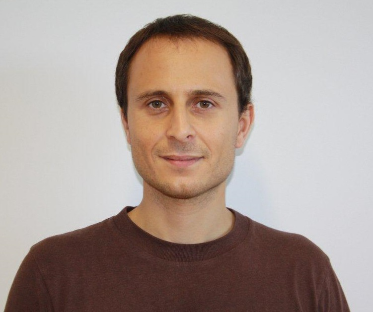

# Welcome to the Informatics and Multimedia Engineerign Blog at ISEL

{: style="width:150px; border-radius:50%;" }

This blog is maintained by **Pedro Fazenda**, Programme Coordinator of the Master Degree in Informatics and Multimedia Engineering at ISEL. Here you will find:

- News and announcements for the programme  
- Research highlights and projects  
- Tips and resources for students  
- Articles on Informatics, Multimedia, and Engineering  

Feel free to explore the posts below. If you want to get in touch, email me at [pedro.fazenda@isel.pt](mailto:pedro.fazenda@isel.pt) or connect via [LinkedIn](https://www.linkedin.com/in/pedrofazenda/).
